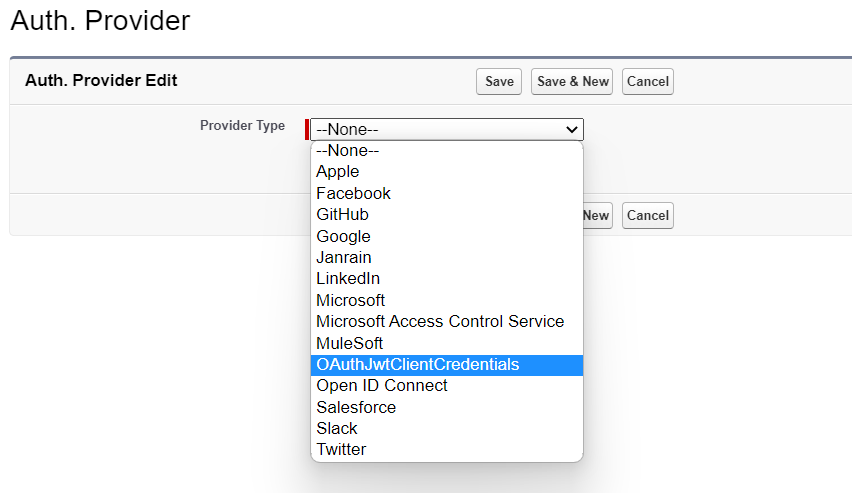
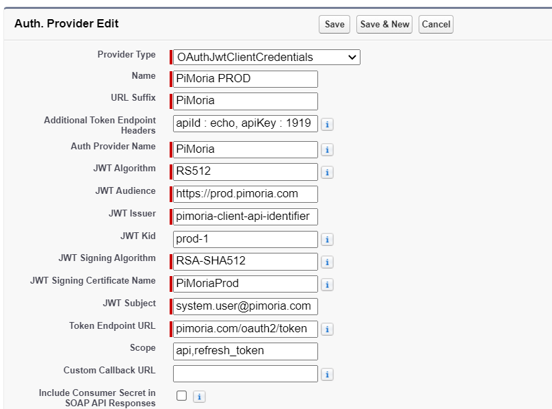
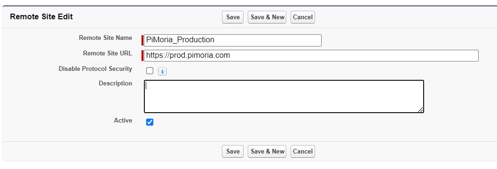
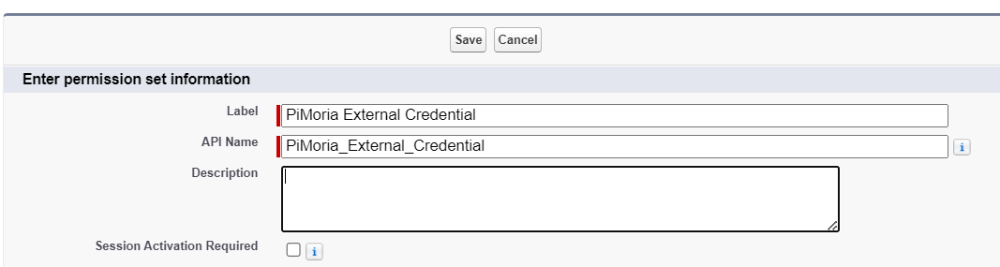
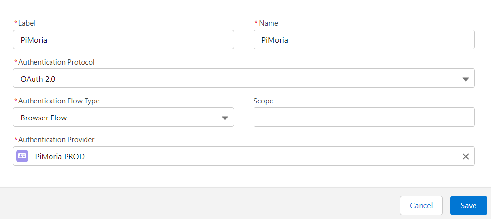
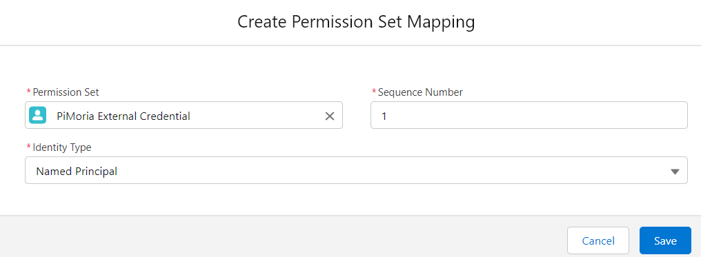
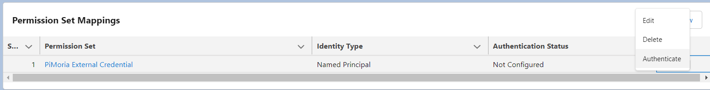
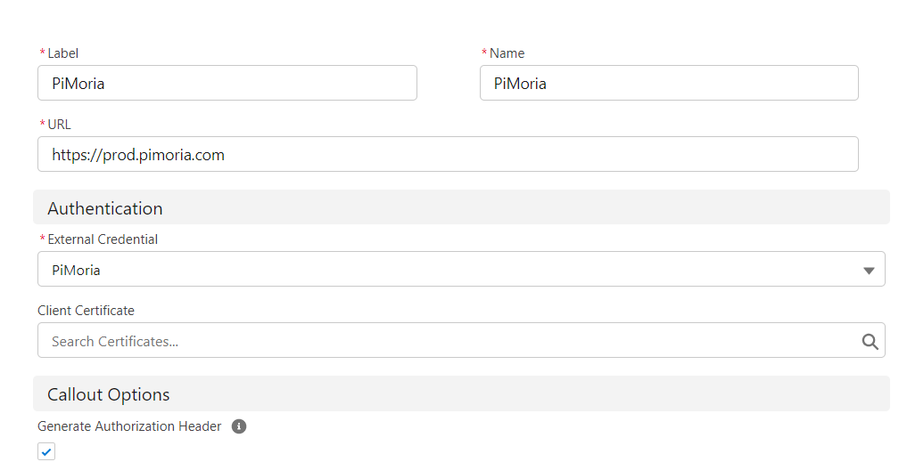

# Lightweight - OAuth 2.0 JWT Client Credentials Authentication Auth. Provider for use with Salesforce Named and External Credentials
## Description
A reusable Auth Provider that can be used with named / external credentials that executes an OAuth 2.0 JWT Client Authentication flow using a Client Credentials grant type.

The grant type standards are described in https://datatracker.ietf.org/doc/html/rfc7523#section-2.2

## IMPORTANT UPDATE ##
Since the Winter 24 release (API v59.0) Salesforce Named Credentials natively Support this flow making this Auth Provider Solution Obsolete for System Integrations using Named Principals.

A reason to keep using this Auth Provider is you need a **Per User principal** based on the JWT Subject or send custom headers to the token endpoint.

## Blog details
https://medium.com/@justusvandenberg/oauth-2-0-jwt-client-credentials-authentication-auth-d269835baae2

## Dependency - Package Info
The following package need to be installed first before installing this package. (In this order)
If you use the *managed package* you need to installed the managed package dependency and if you use the *unlocked version* you need to use the unlocked dependency.
| Info | Value |
|---|---|
|Name|Lightweight - Apex Unit Test Util v2|
|Version|2.4.0-1|
|Managed Installation URL | */packaging/installPackage.apexp?p0=04tP3000000M6OXIA0* |
|Unlocked Installation URL| */packaging/installPackage.apexp?p0=04tP3000000M6Q9IAK* |
|Github URL | https://github.com/jfwberg/lightweight-apex-unit-test-util-v2         |
| | |
|Name|Lightweight - Apex REST Util|
|Version|0.11.0-1|
|Managed Installation URL | */packaging/installPackage.apexp?p0=04tP3000000M6gHIAS* |
|Unlocked Installation URL| */packaging/installPackage.apexp?p0=04tP3000000M6htIAC* |
|Github URL | https://github.com/jfwberg/lightweight-apex-rest-util                 |

## Optional Dependencies
This package has an extension that adds a basic (error) logging functionality and a user mapping utility that allows the Auth Provider to work in a user context using "Per User" instead of "Named Principal".
| Info | Value |
|---|---|
|Name|Lightweight - Auth Provider Util v2|
|Version|0.12.0-1|
|Managed Installation URL | */packaging/installPackage.apexp?p0=04tP3000000MVUzIAO*   |
|Unlocked Installation URL| */packaging/installPackage.apexp?p0=04tP3000000MW1FIAW*   |
|GIT URL                  | https://github.com/jfwberg/lightweight-auth-provider-util |

## Package info
| Info | Value |
|---|---|
|Name|Lightweight - OAuth JWT Client Credentials Auth Provider|
|Version|0.5.0-1|
|Managed Installation URL | */packaging/installPackage.apexp?p0=04tP3000000MWfZIAW* |
|Unlocked Installation URL| */packaging/installPackage.apexp?p0=04tP3000000MWndIAG* |

## Important
- Security is no easy subject: Before implementing this (or any) solution, always validate what you're doing with a certified sercurity expert and your certified implementation partner
- At the time of writing I work for Salesforce. The views / solutions presented here are strictly MY OWN and NOT per definition the views or solutions Salesforce would recommend. Again; always consult with your certified implementation partner before implementing anything.

## Pre-requisites
- A certificate with private key that is used for signing the JWT with a JWS that is imported in the Salesforce certificate key store
- Alternatively you can use a self signed certificate for testing purposes
- The public key needs te be shared with the authorisation server and setup according to their standards, usually a JWKS
- You'll need all the authorization server details that are required to setup the connection

## Assign permissions to Automated Process User
Since the Spring 24 release platform events started running as the Automated Process User. Making the logging fail due to access issue.
To fix this I created a specific permission set for this user that can be assigned using the code below.
```java
insert new PermissionSetAssignment(
    AssigneeId      = [SELECT Id FROM User          WHERE alias = 'autoproc']?.Id,
    PermissionSetId = [SELECT Id FROM PermissionSet WHERE Name  = 'Lightweight_Auth_Provider_Util_AutoProc']?.Id
);
```

## 00 :: Deployment and Preparation
1. Import the JWT signing certificate into Salesforce, Note down the *Certificate API Name*
2. Deploy the *Apex class* and the *Custom Metadata (including layouts)* from this SFDX Pproject to your Org (Or install the package)
3. The package can be found here: *https://[MY_DOMAIN_URL]/packaging/installPackage.apexp?p0=*

## 01 :: Setup the Auth. Provider
In my example I am going to connect an api called "PiMoria"; this my test domain that I will use throughout this example.

1. In setup > Auth Providers > Create a new Auth. Provider Using the *OAuthJwtClientCredentials* class as the type


2. Populate the *Execute Registration As* field first, this is a mandatory field that is not marked as mandatory and will reset the entire form if you forget it. 
3. Populate the fields in the the Auth. Provider. The below table details what is required in the fields
4. Triple check you put in all mandatory fields: If you have forgotten one, you have to re-do them all

| Field Name                           | Description                                                                                                                                                                   | Example                              |
|--------------------------------------|-------------------------------------------------------------------------------------------------------------------------------------------------------------------------------|--------------------------------------|
| Name                                 | Auth Provider API Name                                                                                                                                                        | PiMoria PROD                         |
| URL Suffix                           | The URL suffix that is used in the callback URL Make sure this is the same as the name field                                                                                  | PiMoria                              |
| Additional Token Endpoint Headers    | Optional headers that are send during the API token request. Key value pairs are split with a comma and header key values are set using a colon                               | apiId : echo, apiKey : 1919          |
| Additional Token Endpoint Parameters | Optional POST body parameters that are send during the API token request. Key value pairs are split with a comma and parameter key values are set using a colon               | tenant : 12-345, client_id : ab-cde  |
| Auth Provider Name                   | The name of the Auth Provider: !! This must be the same as the Name field !!                                                                                                  | PiMora                               |
| JWT Algorithm                        | The algoritm used for signing the JWT. Valid values are: 'RS256','RS384','RS512','ES256','ES384','ES512' Note: we are limited to the algorithms supported by the Crypto Class | RS512                                |
| JWT Audience                         | The aud in the JWT                                                                                                                                                            | https://prod.pimoria.com             |
| JWT Issuer                           | The iss in the JWT                                                                                                                                                            | pimoria-client-api-identifier        |
| JWT Kid                              | The Key Id in the JWT                                                                                                                                                         | prod-1                               |
| JWT Signing Algorithm                | The algorithm used to sign the JWT and generate a JWS  'RSA-SHA256','RSA-SHA384','RSA-SHA512','ECDSA-SHA256','ECDSA-SHA384','ECDSA-SHA512'                                    | RSA-SHA512                           |
| JWT Signing Certificate Name         | The certificate API name that is used for signing the certificate                                                                                                             | PiMoriaProd                          |
| JWT Subject                          | The sub field in the JWT                                                                                                                                                      | system.user@pimoria.com              |
| Token Endpoint URL                   | The URL for the token endpoint, usually ends in /oauth2/token                                                                                                                 | https://prod.pimoria.com/oauth2/token|
| Scope                                | Optional value for the scope parameter in the request body                                                                                                                    | api,refresh_token                    |
| Custom Callback URL                  | Optionally you can add your custom callback URL, this should not be required. The code generates the callback URL based on the name                                           |                                      |
| Enable Error Logging                 | Optionally error logging can be enabled to log any errors thrown during the get token process                                                                                 |                                      |
| Enable Per User Mode                 | Optionally the Auth Provider allows for Per User mode instead of Named Principal, to allow for user APIs that require user context. A mapping needs to be setup.              |                                      |
| Enable Per User Login Logging        | Optionally you can add your custom callback URL, this should not be required. The code generates the callback URL based on the name                                           |                                      |


When finished it should look like something like this


## 02 :: Setup The Remote Site Setting(s)
In order to make API call-outs to the token endpoint securely, we must setup a remote site setting for the token endpoint.

1. Go to Setup > Security > Remote Site Settings and click *New*
2. Populate the *Remote Site URL* field with the *Token Endpoint Base URL* and set a *Name* and *Description*
3. Press *Save*
4. If your API Base URL is different than your token URL, you need to create separate Remote Site Setting for this API. In my example case, the base URL is the same.



## 03 :: Create a Permission Set for the External Credential
External Credentials require a Permission Set in order to create a credential type mapping. It's best practice to create a separate Permisison Set for each Extern Credential to keep a strict separation and stick to the least access principle.
At this stage you don't have to assign any permissions, this will happen later.
1. In Setup > Users > Permission Sets, Click *New*
2. Set a *Label* and an *API Name*, write the API Name down, we're going to need this later.
3. Assign the Permission Set to the testing user, probably the user you're logged in with


## 04 :: Setup the External Credential
Your Auth Provider is now ready for testing. The next step is to create an External Credential that authenticates to the token endpoint using the Auth Provider.

1. Go to setup > Security > Named Credentials and click the *External Credentials tab*
2. Click *New*, Set  A Label and a Name
3. Set *Authentication Protocol* to *OAuth 2.0*
4. Set *Authentication Flow Type* to *Browser Flow*. The *Scope* field can be left blank. This is overwritten by our Auth. Provider Settings.
5. Select your created Auth. Provider from the *Auth Provider Picklist* 
6. Press Save

7. Scroll down to the *Permission Set Mappings* section and press *New*
8. For the *Permission Set*, select the Permission Set You created in Step 3.1. Set the *Identity Type* field to *Named Principal*. You can ignore the sequence number. This can stay default.
9. Press Save


## 05 Connect your External Credential through the Auth Provider
You have no finished setting up the external credetials and the auth provider it's time to test it by callign the token endpoint and authenticate.

1. Click on the arrow button next to the Permission Set Mapping in the actions column
2. Click *Authenticate*, Salesforce now call the token endpoint and execute the logic from the Apex class to get a token. It will redirect you to the same page (This is the redirect URL that is auto generated in the class.)

3. If you're successful you get a sucess message, if you're unsuccesful you have to start debugging.


## 06 Debugging and Common Errors
* Forgotten to set the Remote Site Settings
* Forgotten to assign the permission set
* Wrong certificate name (Note this is Case Sensitive, you get a "System.NoDataFoundException: Data Not Available" exception if the certificate API Name is wrong)
* Any other (JWT) configuration details. If this is the case the debug logs with show the response as an *OAuthJwtClientCredentials.TokenException* will be thrown.
I  don't want to go to deep into debugging but a few pointers:
* Set the trace flag on the executing user
* Clean your debug logs in setup, execute the code and see the logs
* Alternatively, open your developer console to stream the logs

## 07 Create a Named Credential
Once you have successfully authenticated your external credential and you want to use this connection from Apex or Flows to call an API we'll need a Named Credential
1. Go to setup > Security > Named Credentials and click the *NAmed Credentials tab*
2. Click *New* (Note we are NOT creating a legacy named credential, we're modern)
3. Give your credential a *Label* and a *Name*
4. Populate the *URL* field with the base URL of the API (Not the token endpoint). Quite often these are the same.
5. Select your *External Credential* you created in step 4.2
6. Make sure *Generate Authorization Header* is selected, this is by default
7. Optionally you can select a namespace and a network if you use prive connect.
8. Press Save


## 08 Test the Named Credential
Now you have everything you need. Let's open up and execute anonymous window and call one of our endpoints.
* If there is an invalid token a 401 response code will be received. If this happens the external credential will call the refresh token logic through the Auth Provider Automatically and take care of all of that overhead.
*  *callout:[NamedCredentialApiNAme]:* will be replaced by the base URL as specified in the step 7.4.
* Update and run the following code snippet and you should be able to successfully call the API.

```java
HttpRequest request = new HttpRequest();
request.setEndPoint('callout:PiMoria/api/authentication-test');
request.setMethod('POST');
HttpResponse response = new HTTP().send(request);
System.debug(response.getBody());
```
## Note on coding
- Everything is kept in a single class, to make it small and stand-alone. This includes any validations that could have been in validation rules or messages that could have been in custom labels. This is a contious design decision to keep everything together.
- Any confguration values should be in a constant at the top following the common code structure
- Always use the this keyword properly for readability
- Always add ApexDoc headers even if it seems overkill, it's just good practice and easy to document
- Certificate related methods cannot be tested because Apex cannot mock certificates. The alternative is to supply a certificate name in the test class but I'd like to keep the tests org agnostic
- It's OK to use the @SuppressWarnings annotation but always mention the false-positives
	
## Steps to import a certificate store (JKS) in a Scratch Org when getting "Data Not Available" error message on import
In some cases there is a bug in the certificate import that gives an error if you try to import a JKS It says "Data Not Available".
I have this issue in all my scratch orgs. There is a simple way to resolve this.
1) Go to setup > certificate and key management
2) Create a self signed certficate
3) Go to Setup >> Identity provider
4) Click enable Identity Provider and select the self signed certificate you just created and press save
5) Press the disable button, as we dont really need it
6) Go back to Setup > Certificate and Key Management and try to "import from keystore" again, it should work now.
